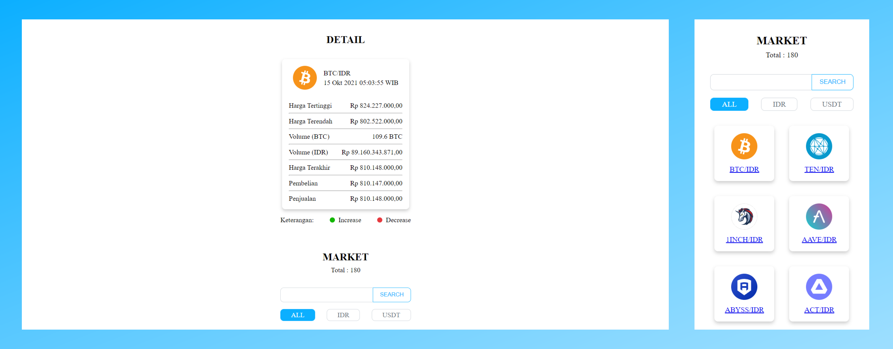

# Monitoring-Cryptocurrency

Aplikasi Monitoring Cryptocurrency. Data diperbarui setiap 10s. Aplikasi ini dibuat menggunakan [INDODAX API](https://github.com/btcid/indodax-official-api-docs)

## Tampilan Aplikasi

## Fitur Aplikasi

| Versi | Deskripsi | Live Preview |
| --- | --- | --- |
| v1 | Menampilkan 180 koin berdasarkan kategori dan detailnya | https://indodaxkel06b.netlify.app/ |
| v2 | Penambahan fitur search autocomplete dan pagination | https://indodaxkel06bv2.netlify.app/ |

## Pengembang Proyek

- Mochammad Arya Salsabila (19081010001)
- Nadhif Mahardika Awandi (19081010064)
- Dimas Seno Herlambang (19081010152)

## Lisensi 

Didistribusikan di bawah Lisensi MIT. Lihat `LICENSE` untuk informasi lebih lanjut.
